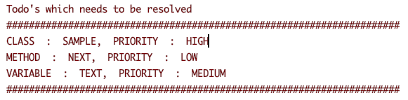

# Todo Annotation
With the help of this you can annotate a class, method or a field which needs to be looked into in the future.
Compiler throws error during compilation when there are some Todos in the project that needs to be resolved

## Getting Started
Root build.gradle
```
repositories {
  jcenter()
}
```
App build.gradle
```
apply plugin: 'kotlin-kapt'

implementation 'com.innovatorlabs.annotations:annotations:1.0.0'

kapt 'com.innovatorlabs.annotationcompiler:annotationcompiler:1.0.0'
```

## Usages
```
@Todo(note = "High Priority", priority = TodoPriority.HIGH)
class Sample {

    @Todo(note = "Medium Priority", priority = TodoPriority.MEDIUM)
    lateinit var text: String

    @Todo(note = "Low Priority", priority = TodoPriority.LOW)
    fun next() {

    }
}

```


